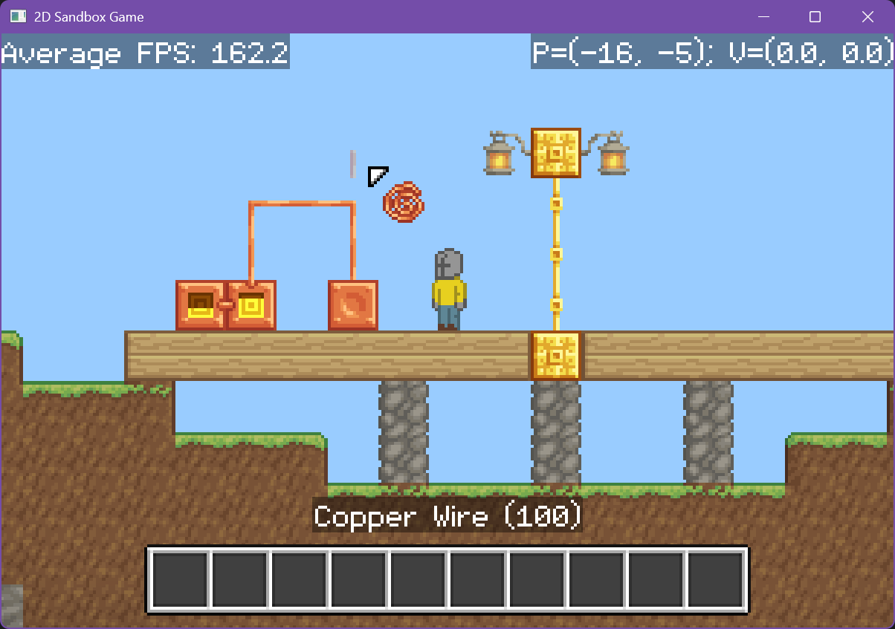
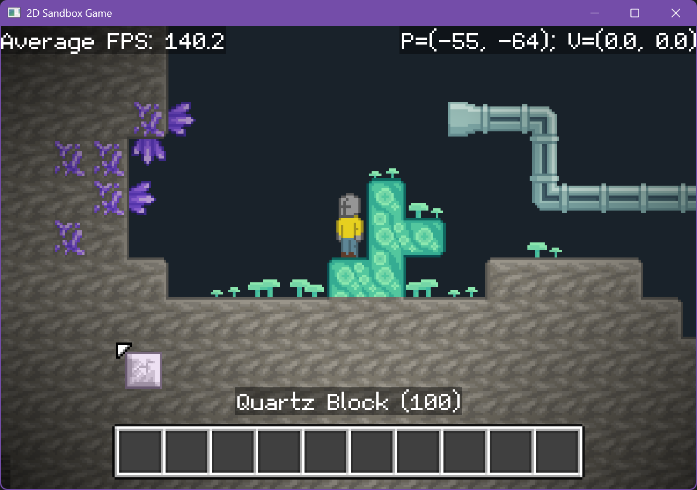
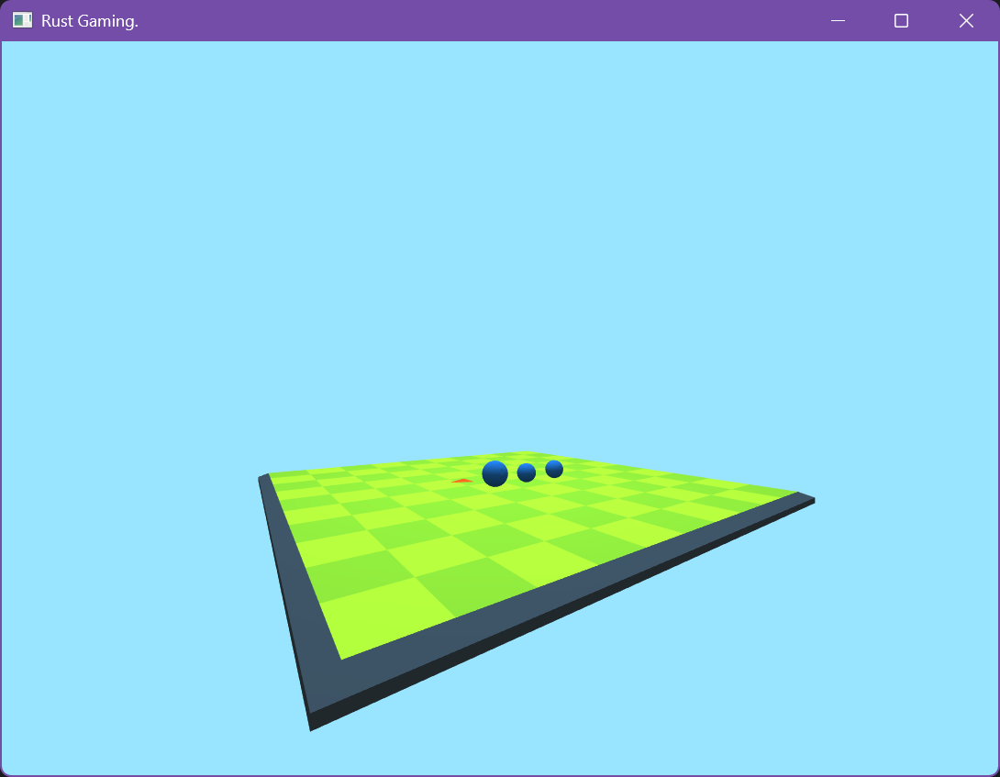

# Innovus

A lightweight 2D/3D game engine for Rust using OpenGL.

The most robust aspects of the engine thus far include:

- A graphics API which provides idiomatic Rust wrappers for commonly used OpenGL features such as shaders, vertex arrays, and texture objects.
- A math library providing generic vector, matrix, and rectangle types, as well as timing utilities.
- A couple of arena allocator types for collecting a bunch of externally-"owned" objects in one place (e.g. for physics calculations).
- A 2D axis-aligned bounding box physics engine.

At the moment, I am mostly focused on developing a 2D sandbox game under the Innovus framework.
My goal is to integrate some of the more broadly useful aspects of that game into Innovus itself.

## 2D Sandbox Game (`sandbox`)

A while back, I created [a version of this game in Java](https://github.com/xarkenz/WorkingTitleGame). Since then,
I've decided to migrate the project to Rust (mostly as a challenge for myself) under the Innovus framework. Now,
this version of the game surpasses the Java version in many ways.

All graphics for the game were created by hand using Piskel, a free program for drawing pixel art.

## 3D Snake Game (`snek`)

An extremely unfinished version of Snake with 3D visuals.

